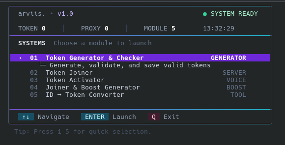
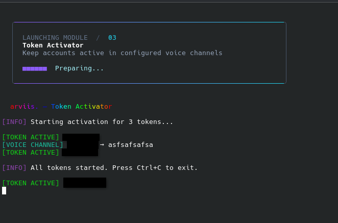
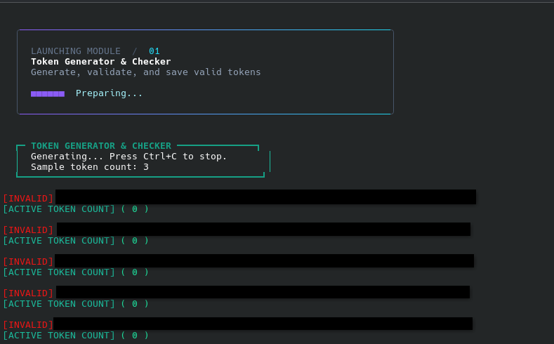

<div align="center">

# TokenALL

**A modern terminal control center for managing multiple Discord account utilities from one place.**


Built by **arviis.**

</div>

TokenAll brings its generator/checker, server joiner, voice activator, boost workflow, and ID conversion tool together behind a single interactive command line interface. The dashboard includes keyboard navigation, live file counters, module descriptions, status feedback, and animated launch transitions.

> [!WARNING]
> Discord self-bots and automated user-account actions may violate Discord's Terms of Service and may result in account restrictions or termination. This project is unofficial, is not affiliated with Discord, and should only be used in environments and with accounts you own or are explicitly authorized to test.

> [!CAUTION]
> Discord tokens are credentials. Never publish real tokens, API keys, proxy credentials, or a populated `settings.json`. Screenshots in this README contain redacted account data.

## Table of contents

- [Preview](#preview)
- [Highlights](#highlights)
- [Modules](#modules)
- [Requirements](#requirements)
- [Installation](#installation)
- [Configuration](#configuration)
- [Input and output files](#input-and-output-files)
- [Usage](#usage)
- [Keyboard controls](#keyboard-controls)
- [Project structure](#project-structure)
- [Troubleshooting](#troubleshooting)
- [Security and compatibility](#security-and-compatibility)

## Preview

### Interactive control center

The main dashboard displays the available modules, current token and proxy counts, system status, and the local time. Use the arrow keys to move between modules or press a number for quick selection.

<div align="center">
  
</div>

### Token Activator

The Activator starts the configured accounts, reports each successful session, and connects an account to its matching voice channel when a valid channel ID is available.

<div align="center">
  
</div>

### Token Generator & Checker

The Generator & Checker shows the active sample count, reports each validation result, and keeps a running count of accepted entries.

<div align="center">
  
</div>

## Highlights

- One interactive dashboard for all five modules
- Arrow-key and `W`/`S` navigation
- Number-key shortcuts for immediate module selection
- Live token, proxy, module, and clock indicators
- Clear module descriptions and category labels
- Animated module launch screen
- Central JSON configuration
- Optional proxy and CAPTCHA service support
- Separate success and failure output files
- Duplicate filtering in token lists
- Graceful timeout and error reporting
- Windows UTF-8 terminal setup included

## Modules

| Key | Module | Source | Purpose |
| ---: | --- | --- | --- |
| `1` | Token Generator & Checker | `modules/generator.js` | Reads queued entries or creates sample-shaped test candidates, validates them, and separates accepted and rejected results. |
| `2` | Token Joiner | `modules/joiner.js` | Processes accounts from `data/tokens.txt`, optionally uses proxies/CAPTCHA configuration, and attempts to join the configured server. |
| `3` | Token Activator | `modules/activator.js` | Starts configured account sessions and maps each account to a configured voice channel by array position. |
| `4` | Joiner & Boost Generator | `modules/booster.js` | Runs the server-join workflow and optionally processes available server boost subscriptions. |
| `5` | ID ➙ Token Converter | `modules/idtotoken.js` | Converts a numeric Discord user ID to the Base64 text used by the first token segment. |

> [!NOTE]
> The ID Converter only produces the Base64-encoded first segment. It does **not** create a complete or usable Discord token.

## Requirements

- [Node.js](https://nodejs.org/) `20.18.0` or newer
- npm, included with Node.js
- A terminal with ANSI color and UTF-8 support
- Windows 10/11, Windows Terminal, PowerShell, Command Prompt, or a modern Linux terminal
- Network access for dependency installation and modules that communicate with Discord

The Node.js requirement is determined by `discord.js-selfbot-v13@3.7.1`, which declares Node.js `>=20.18`.

## Installation

### Windows — recommended

1. Install Node.js `20.18+`.
2. Download or clone the project.
3. Open the TokenAll directory.
4. Double-click `başlat.bat`.

The launcher sets UTF-8 mode, adjusts the console size, installs or updates npm dependencies, and opens the control center.

### Manual installation

```bash
npm install --legacy-peer-deps
npm start
```

You can also start the application directly:

```bash
node arvis.js
```

## Configuration

All module settings live in `settings.json`. The example below uses placeholders only—replace them locally and never commit real credentials.

```json
{
  "generator": {
    "sampleTokens": [
      "YOUR_SAMPLE_VALUE"
    ]
  },
  "joiner": {
    "captcha_service": "capmonster",
    "captcha_api_key": "",
    "inviteCode": "YOUR_INVITE_CODE",
    "joinDelay": 3000,
    "useProxies": false
  },
  "activator": {
    "HesapTOKEN": [
      "YOUR_ACCOUNT_TOKEN"
    ],
    "SesKanallari": [
      "YOUR_VOICE_CHANNEL_ID"
    ]
  },
  "booster": {
    "captcha_service": "capmonster",
    "captcha_api_key": "",
    "inviteCode": "YOUR_INVITE_CODE",
    "joinDelay": 3000,
    "useProxies": false,
    "boost": {
      "enabled": false,
      "delay": 1000,
      "serverId": "YOUR_SERVER_ID"
    }
  }
}
```

### Generator settings

| Setting | Type | Description |
| --- | --- | --- |
| `generator.sampleTokens` | `string[]` | Sample values used to preserve candidate length and separator placement. Placeholder-only lists are rejected. |

The generator checks `data/control-tokens.txt` first. When that file contains entries, it consumes them one line at a time before creating test candidates from the configured samples.

### Joiner settings

| Setting | Type | Description |
| --- | --- | --- |
| `joiner.inviteCode` | `string` | A Discord invite code or full invite URL. |
| `joiner.joinDelay` | `number` | Delay between accounts in milliseconds. The module enforces a minimum of 1,000 ms. |
| `joiner.useProxies` | `boolean` | Enables random proxy selection from `data/proxies.txt`. |
| `joiner.captcha_service` | `string` | CAPTCHA provider name, such as `capmonster` or `2captcha`. |
| `joiner.captcha_api_key` | `string` | Optional CAPTCHA provider API key. Leave empty to disable CAPTCHA integration. |

### Activator settings

| Setting | Type | Description |
| --- | --- | --- |
| `activator.HesapTOKEN` | `string[]` | Account tokens to start. Empty entries are ignored. |
| `activator.SesKanallari` | `string[]` | Voice channel IDs mapped to tokens by index. The first channel belongs to the first token, and so on. |

If a channel ID is missing or still contains a placeholder, the corresponding account can start without attempting a voice connection.

### Booster settings

| Setting | Type | Description |
| --- | --- | --- |
| `booster.inviteCode` | `string` | A Discord invite code or full invite URL. |
| `booster.joinDelay` | `number` | Delay between account operations in milliseconds. |
| `booster.useProxies` | `boolean` | Enables proxy selection from `data/proxies.txt`. |
| `booster.captcha_service` | `string` | Optional CAPTCHA provider name. |
| `booster.captcha_api_key` | `string` | Optional CAPTCHA provider API key. |
| `booster.boost.enabled` | `boolean` | Enables or disables boost processing. |
| `booster.boost.delay` | `number` | Delay before boost operations in milliseconds. |
| `booster.boost.serverId` | `string` | Target server ID for available boost subscriptions. |

## Input and output files

Keep one value per line in all `.txt` input files.

| File | Used by | Description |
| --- | --- | --- |
| `data/tokens.txt` | Joiner, Booster | Primary account list. Duplicate entries are removed in memory before processing. |
| `data/proxies.txt` | Joiner, Booster | Optional proxy list. URL-style proxy strings are supported by the configured proxy agent. |
| `data/control-tokens.txt` | Generator | Optional validation queue. The generator removes entries as it consumes them. |
| `data/verified-tokens.txt` | Generator | Entries that returned an accepted validation response. |
| `data/generator-invalid.txt` | Generator | Rejected or unsuccessful validation entries. |
| `data/joined-tokens.txt` | Joiner | Accounts recorded after a successful join. Used to skip previously completed entries. |
| `data/failed-tokens.txt` | Joiner | Accounts that timed out or failed the join workflow. |
| `data/booster-joined.txt` | Booster | Accounts recorded after a successful booster join workflow. |
| `data/booster-failed.txt` | Booster | Accounts that failed during the booster workflow. |

Some output files are created only after the associated module runs for the first time.

## Usage

1. Fill in the required values in `settings.json`.
2. Add account entries to `data/tokens.txt` when using the Joiner or Booster.
3. Add proxies to `data/proxies.txt` only if proxy use is enabled.
4. Start TokenAll with `başlat.bat`, `npm start`, or `node arvis.js`.
5. Select a module with the keyboard.
6. Follow the status messages printed by that module.
7. For long-running modules, press `Ctrl+C` to stop.

## Keyboard controls

| Key | Action |
| --- | --- |
| `↑` / `↓` | Move through the module list. |
| `W` / `S` | Alternative navigation keys. |
| `Enter` / `Space` | Launch the selected module. |
| `1`–`5` | Launch a module immediately. |
| `Q` / `Esc` / `0` | Exit TokenAll. |
| `Ctrl+C` | Stop a long-running module. |

After a module exits, press `Enter` to return to the main menu or enter `N` to close TokenAll.

## Project structure

```text
TokenAll/
├── arvis.js                       # Interactive control center
├── başlat.bat                     # Windows launcher
├── settings.json                   # Central module configuration
├── package.json                   # Project metadata and dependencies
├── package-lock.json              # Reproducible dependency versions
│
├── data/                           # All text-based inputs and outputs
│   ├── tokens.txt                 # Joiner/Booster account input
│   ├── proxies.txt                # Optional proxy input
│   ├── control-tokens.txt         # Generator validation queue
│   ├── verified-tokens.txt        # Generator accepted output
│   ├── generator-invalid.txt      # Generator rejected output
│   ├── joined-tokens.txt          # Joiner success output (generated)
│   ├── failed-tokens.txt          # Joiner failure output (generated)
│   ├── booster-joined.txt         # Booster success output (generated)
│   └── booster-failed.txt         # Booster failure output (generated)
│
├── modules/
│   ├── generator.js               # Generator & Checker
│   ├── joiner.js                  # Server Joiner
│   ├── activator.js               # Account/voice Activator
│   ├── booster.js                 # Joiner & Boost workflow
│   └── idtotoken.js               # ID/Base64 segment converter
│
└── docs/
    └── screenshots/
        ├── control-center.png
        ├── token-activator.png
        └── token-generator.png
```

## Troubleshooting

### `Cannot read properties of null (reading 'all')`

This error is associated with the old `discord.js-selfbot-v13@2.15.1` READY handler. TokenAll is configured for `3.7.1`. Reinstall the locked dependencies:

```bash
npm install --legacy-peer-deps
npm ls discord.js-selfbot-v13 --depth=0
```

The version check should report `discord.js-selfbot-v13@3.7.1`.

### The interface has broken borders or incorrect characters

- Use a UTF-8 capable terminal.
- On Windows, start the app with `başlat.bat`; it automatically selects UTF-8 code page 65001.
- Use a modern monospace font such as Cascadia Mono, JetBrains Mono, or Consolas.
- Make the terminal at least 80 columns wide.

### A voice channel cannot be found

- Confirm that the channel ID is correct.
- Confirm that token and channel positions match in the two Activator arrays.
- Confirm that the account can access the target server and voice channel.
- Placeholder channel IDs are intentionally skipped.

### A login or join operation times out

- Check the network connection and proxy format.
- Disable `useProxies` when `data/proxies.txt` is empty.
- Increase `joinDelay` to reduce rate-limit pressure.
- Confirm that the invite code has not expired.
- Review the generated failure file for the selected module.

### The menu closes but a module keeps running

Generator and Activator are designed as long-running modules. Stop them with `Ctrl+C`; TokenAll will then return control to the terminal flow.

## Security and compatibility

- Never commit populated token, proxy, API-key, joined, failed, or validation-result files.
- Redact account names, IDs, tokens, and channel details before sharing screenshots or logs.
- Keep `package-lock.json` so installations use the tested dependency version.
- The `discord.js-selfbot-v13` package is unofficial and has been marked unsupported by its maintainer.
- Discord API changes may break user-account automation without warning.
- No account safety, API stability, or service availability is guaranteed.
